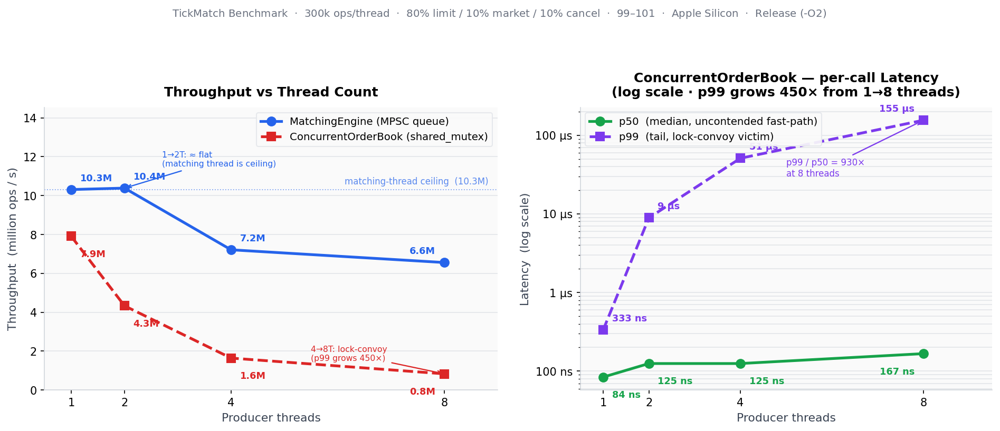

# MatchCore

A high-performance, multithreaded limit order book matching engine in C++20.

---

## What is a matching engine?

Every financial exchange — NYSE, Nasdaq, CME — runs a matching engine at its core. It maintains two sorted lists of resting orders: buyers willing to pay up to some price (the *bid* side) and sellers willing to accept at least some price (the *ask* side). When a new order arrives, the engine checks whether it crosses the opposite side and executes trades at the best available price. The correctness and speed of this system directly determine how fair and efficient the market is.

This project implements the full matching lifecycle: submission, price-time priority matching, partial fills, cancellation, and concurrent access — the same building blocks used in production exchange infrastructure.

---

## Features

- **Price-time priority** — best price first; FIFO within a price level
- **Limit and market orders** — limit orders rest in the book; market orders sweep and discard residual
- **O(1) order cancellation** — via a stable iterator stored in a hash-map index
- **Two thread-safety models** — MPSC queue engine or shared-mutex direct access (see Architecture)
- **~10 million orders/second** throughput on a single matching thread

---

## Architecture

### Order book data structures

```
BID side — sorted high→low           ASK side — sorted low→high
─────────────────────────────────    ─────────────────────────────────
std::map<Price, list<Order>,         std::map<Price, list<Order>>
         std::greater<Price>>
─────────────────────────────────    ─────────────────────────────────
$100.00 → [Order A] → [Order B]      $100.50 → [Order C]     ← best ask
 $99.50 → [Order D]                  $101.00 → [Order E] → [Order F]
 $99.00 → [Order G] → [Order H]

index_: unordered_map<OrderId, {side, price, list::iterator}>
         ↑ O(1) cancel lookup — jumps directly to the list node
```

**Why `std::map` over a heap?** A heap gives O(1) peek at the best price but O(n) arbitrary removal. Since cancel must remove any order in the book, O(n) cancel is unacceptable. `std::map` (red-black tree) gives O(log n) for every operation: insert, erase, lookup, and price-sorted iteration.

**Why `std::list` over `std::deque`?** `std::list` iterators are *stable* — they remain valid across any other insertions or deletions in the same list. This lets the cancel index store a live iterator per order for O(1) erase. `std::deque` invalidates iterators on structural modifications, which would corrupt the index.

### Concurrency models

Two designs are provided, optimised for different use cases:

```
  ── MatchingEngine (MPSC queue) ──────────────────────────────────────────

  Producer 1 ──┐
  Producer 2 ──┤ submit_limit()    ┌─ Matching Thread ──────────────────┐
  Producer N ──┘ ──→ [queue] ──────┤  batch drain (O(1) swap)           │
                   (mutex, brief)  │  OrderBook.add_limit() / cancel()  │
                                   │  ← no lock on the book itself       │
                                   └──────────────── Trade callback ─────┘

  ── ConcurrentOrderBook (shared_mutex) ───────────────────────────────────

  Thread 1 ──┐
  Thread 2 ──┤ add_limit()   ─→  unique_lock (write) ─→ OrderBook
  Thread N ──┘ best_bid()   ─→  shared_lock  (read)  ─→ OrderBook
```

**MatchingEngine** is the higher-throughput option. Multiple producer threads push requests into a mutex-protected deque; a single dedicated matching thread drains the queue using a *batch drain* — it swaps the entire deque out atomically (O(1) while holding the lock) then processes the batch lock-free. The `OrderBook` itself is never locked, because only one thread ever touches it.

**ConcurrentOrderBook** wraps `OrderBook` with a `std::shared_mutex`. Write operations (`add_limit`, `add_market`, `cancel`) take an exclusive `unique_lock`; read queries (`best_bid`, `best_ask`) take a `shared_lock`, allowing concurrent reads during write-free intervals. Trades are returned by value and dispatched *after* releasing the lock — if they were dispatched inside the lock, any callback that queried the book would deadlock (non-recursive mutex).

---

## Benchmark results

**Workload:** 300,000 ops/thread · 80% limit / 10% market / 10% cancel · prices $99.00–$101.00 · qty 1–50  
**Hardware:** Apple Silicon (ARM64) · Release build (`-O2`) · `std::chrono::steady_clock`



*Left: MatchingEngine throughput stays near its single-thread ceiling regardless of producer count — the book is never locked. ConcurrentOrderBook throughput halves with each doubling of threads as writers serialise on `unique_lock`. Right: p50 latency barely moves (84→167 ns) while p99 explodes 450× (333 ns→155 µs) — the lock-convoy effect.*

### A) MatchingEngine — MPSC queue, dedicated matching thread

| Threads | Throughput (ops/s) | Trades | Trades/op |
|--------:|-------------------:|-------:|----------:|
| 1 | 10,311,965 | 229,047 | 0.763 |
| 2 | 10,385,931 | 458,193 | 0.764 |
| 4 | 7,211,507 | 917,329 | 0.764 |
| 8 | 6,556,677 | 1,836,971 | 0.765 |

Throughput is nearly flat at 1–2 threads, bounded by the single matching thread. The modest drop at 4–8 threads reflects contention on the *queue* mutex (not the book) as more producers compete to enqueue.

### B) ConcurrentOrderBook — `shared_mutex`, direct multi-thread access

| Threads | Throughput (ops/s) | Mean lat | p50 lat | p99 lat | Trades/op |
|--------:|-------------------:|---------:|--------:|--------:|----------:|
| 1 | 7,906,874 | 110 ns | 84 ns | 333 ns | 0.763 |
| 2 | 4,329,282 | 445 ns | 125 ns | 8.9 µs | 0.764 |
| 4 | 1,639,248 | 2.4 µs | 125 ns | 51.0 µs | 0.765 |
| 8 | 829,067 | 9.6 µs | 167 ns | 155.3 µs | 0.766 |

Throughput falls roughly in half with each doubling of threads — every writer serializes on `unique_lock`. The p99 column tells the more important story: tail latency grows **450× from 1 to 8 threads** while p50 grows only **2×**. This is the *lock-convoy effect*: one thread sweeping a large order across multiple price levels holds the lock while all other threads queue up, then they all re-contend simultaneously when it releases.

`Trades/op` is stable across all configurations (0.763–0.766). Because the workload is pre-generated from a fixed seed, the aggregate match rate is a property of the price distribution and must be concurrency-model-independent. Drift here would indicate a correctness bug (double-fill or lost order).

---

## Design decisions

### Integer prices

`Price = int64_t` in tick units (e.g. cents: `$100.50 → 10050`). Floating-point prices accumulate rounding errors across millions of operations and differ between hardware and compilers. Every real exchange uses an integer tick representation.

### Maker/taker pricing

Trades execute at the *maker's* (resting order's) price, not the taker's. This is the universal exchange convention: the passive side sets the price; the aggressive side accepts it. A buy limit at $101 that crosses a resting ask at $100 executes at $100, giving the taker price improvement.

### Why per-side locking (bid lock + ask lock) doesn't improve throughput

It looks attractive: separate the two sides, let buys and sells run in parallel. It fails because matching always touches *both* sides atomically — a buy must write the ask side (consume resting sells) and then write the bid side (insert any residual). Both operations need both locks simultaneously. Acquiring them in a fixed order to prevent deadlock forces both buy threads and sell threads to contend on the same first lock, serializing them identically to a single global mutex — with added complexity and no benefit.

### Batch drain pattern

The matching thread swaps the entire request queue out with a fresh empty deque while holding the lock for that O(1) swap, then releases before doing any real work. Producers can immediately resume enqueuing. This decouples submission latency from match latency: no producer ever waits for a complex multi-level match to complete.

### Market order residual handling

Unfilled market quantity is silently discarded. A resting market order would execute against the next incoming order at any price, which is semantically undefined. All real exchanges handle this the same way.

---

## Project structure

```
matchcore/
├── include/
│   ├── Types.hpp               — Order, Trade, integer Price, now_ns()
│   ├── OrderBook.hpp           — Core book: map + list + cancel index
│   ├── MatchingEngine.hpp      — MPSC queue + dedicated matching thread
│   └── ConcurrentOrderBook.hpp — shared_mutex wrapper; design rationale
├── src/
│   ├── OrderBook.cpp           — Price-time priority matching loops
│   ├── MatchingEngine.cpp      — Batch drain, std::visit dispatch
│   ├── ConcurrentOrderBook.cpp — Thin lock wrappers
│   └── main.cpp                — Demo: build a book, cross, sweep, cancel
├── test/
│   ├── unit_test.cpp           — 21 single-threaded correctness tests (62 checks)
│   └── consistency_test.cpp    — 4 multithreaded invariant tests
└── bench/
    ├── bench.cpp               — Quick MatchingEngine throughput sweep
    └── phase3_bench.cpp        — Full throughput + latency comparison
```

---

## Build and run

**Requirements:** CMake ≥ 3.20, a C++20 compiler (GCC 13+ or Clang 16+), POSIX threads.

```bash
# Configure and build (Release)
cmake -S . -B build -DCMAKE_BUILD_TYPE=Release
cmake --build build -j$(nproc)

# Run all tests
ctest --test-dir build --output-on-failure

# Run tests individually
./build/unit_test           # single-threaded correctness (62 checks)
./build/consistency_test    # multithreaded invariants

# Run the demo
./build/demo

# Run benchmarks
./build/phase3_bench              # full throughput + latency table (default: 300k ops/thread)
./build/phase3_bench 1000000      # higher N for more stable numbers
./build/bench 4 500000            # quick MatchingEngine sweep: 4 threads, 500k ops each
```

---

## Tech stack

- **Language:** C++20 (concepts, `std::variant`, designated initialisers, `if constexpr`)
- **Concurrency:** `std::thread`, `std::mutex`, `std::shared_mutex`, `std::atomic`
- **Build:** CMake 3.20+ with CTest integration
- **Dependencies:** C++ standard library only — no third-party libraries

---

## Future improvements

| Area | Description |
|------|-------------|
| Lock-free queue | Replace the mutex-protected `std::deque` in `MatchingEngine` with a lock-free MPSC queue (e.g. Dmitry Vyukov's intrusive queue). Eliminates the queue-contention drop seen at 4+ producer threads. |
| Memory pools | Allocate `std::list` and `std::map` nodes from a slab allocator. Eliminates per-node `malloc` on the hot path, which can dominate at high order rates. |
| Multiple instruments | Run one `MatchingEngine` per instrument in parallel. The single-threaded book-per-instrument model is how most production systems achieve horizontal scaling. |
| IOC / FOK order types | Immediate-or-cancel (fill what you can, cancel the rest) and fill-or-kill (fill everything or cancel the entire order) are standard exchange order types. |
| Order book snapshots | Periodic consistent snapshots of the full depth for market data distribution, without blocking the matching thread. |
